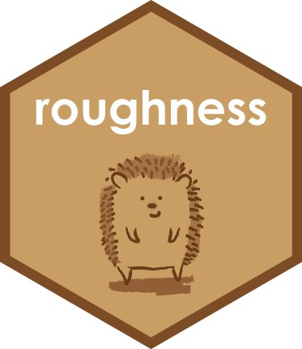

<!-- README.md is generated from README.Rmd. Please edit that file -->

```{r, include = FALSE}
knitr::opts_chunk$set(
  collapse = TRUE,
  comment = "#>",
  fig.path = "README-"
)
``` 

# ESReport <a href='https://tzerk.github.io/roughness/'></a>

<!-- badges: start -->
[](https://ci.appveyor.com/project/tzerk/roughness)
[](https://travis-ci.org/tzerk/roughness)
<!-- badges: end -->

> [Find a full documentation of the package on the project page](https://tzerk.github.io/roughness/)

## Overview

A collection of R functions related to soil surface roughness

## Installation

The 'roughness' package is not available on the official CRAN servers. 

However, the latest development builds can directly be installed from GitHub. Simply run the following from an R console

```{r, eval = FALSE}
if(!require("devtools"))
  install.packages("devtools")
devtools::install_github("tzerk/roughness")
```

## Note

This version is a development version and it comes without any guarentee!

## License

The ESReport package is licensed under the GPLv3. See these files in the main directory for additional details: 

- LICENSE - ESReport package license (GPLv3)
